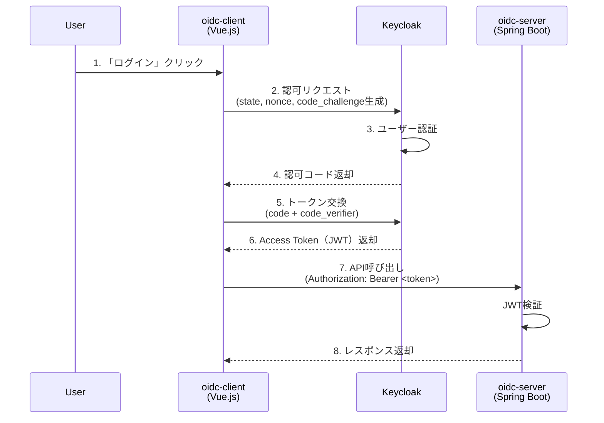
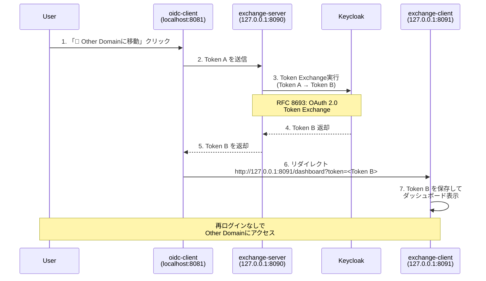
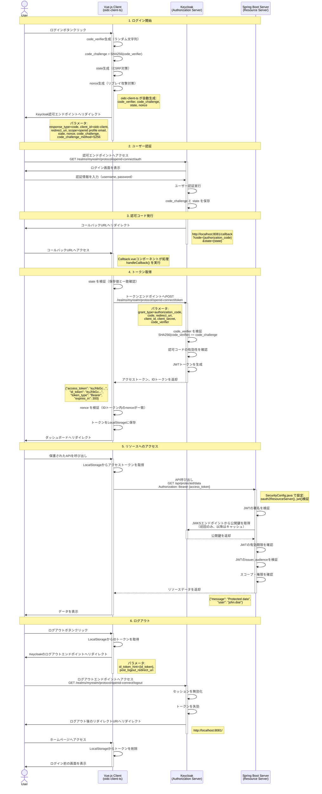

# OIDC Token Exchange - クイックスタートガイド

このガイドでは、Keycloakのセットアップから動作確認まで、すべての手順を説明します。

## 1. 前提条件

### 1-1. 必要なソフトウェア

```bash
# Node.js バージョン確認
node --version  # v18以上

# Java バージョン確認
java -version   # 21以上
```

### 1-2. Keycloak準備

以下のいずれかの方法を選択：

1. **ローカル版（推奨）**: Keycloak 26.5.2 ZIPを `oidc-idp/keycloak-26.5.2/` に解凍
2. **Docker版**: Dockerがインストールされていること

## 2. 簡単起動（推奨）

### 2-1. Keycloakを起動

```bash
# Windows
cd oidc-idp\keycloak-26.5.2\bin
set KC_HTTP_PORT=8082
kc.bat start-dev

# Linux / Mac
cd oidc-idp/keycloak-26.5.2/bin
KC_HTTP_PORT=8082 ./kc.sh start-dev
```

**起動完了まで1-2分待機** → http://localhost:8082 にアクセスして確認

💡 **ヒント**: 新しいターミナルウィンドウで実行し、起動したままにしてください。

### 2-2. Keycloak設定（初回のみ）

初回起動時のみ、以下の設定が必要です。

#### 2-2-1. 管理コンソールにログイン

1. http://localhost:8082 を開く
2. Username: `admin` / Password: `admin`

#### 2-2-2. Realmを作成

1. 左上の「Master」▼をクリック → 「Create Realm」
2. **Realm name**: `myrealm`
3. 「Create」をクリック

#### 2-2-3. テストユーザーを作成

1. 左メニュー「Users」→「Add user」
2. **Username**: `user` → 「Create」
3. 「Credentials」タブ → 「Set password」
4. **Password**: `password` / **Temporary**: `OFF` → 「Save」

#### 2-2-4. クライアント設定（oidc-client）

1. 左メニュー「Clients」→「Create client」
   - **Client type**: `OpenID Connect`
   - **Client ID**: `oidc-client`
   - 「Next」をクリック

2. **Capability config**:
   - **Client authentication**: `ON`
   - **Authorization**: `OFF`
   - **Standard flow**: `ON`
   - **Direct access grants**: `ON`
   - 「Next」をクリック

3. **Login settings**:
   - **Valid redirect URIs**: `http://localhost:8081/*`
   - **Valid post logout redirect URIs**: `http://localhost:8081/`
   - **Web origins**: `http://localhost:8081`
   - 「Save」をクリック

4. **Advanced settings**（PKCEを有効化）:
   - 「Advanced」タブを開く
   - **Proof Key for Code Exchange Code Challenge Method**: `S256`
   - 「Save」をクリック

5. **Service Account Rolesを有効化**（Token Exchangeで必要）:
   - 「Service account roles」タブを開く
   - 「Assign role」をクリック
   - Filter by clients **ON** にする
   - `realm-management` → **`manage-clients`** を選択
   - 「Assign」をクリック

#### 2-2-5. クライアント設定（exchange-server）

Token Exchange APIを実行するためのクライアントを作成します。

1. 左メニュー「Clients」→「Create client」
   - **Client type**: `OpenID Connect`
   - **Client ID**: `exchange-server`
   - 「Next」をクリック

2. **Capability config**:
   - **Client authentication**: `ON`
   - **Authorization**: `OFF`
   - **Standard flow**: `OFF`
   - **Direct access grants**: `ON`
   - 「Next」をクリック

3. **Login settings**: （空欄のまま）
   - 「Save」をクリック

4. **Service Account Rolesを有効化**:
   - 「Service account roles」タブを開く
   - 「Assign role」をクリック
   - Filter by clients **ON** にする
   - `realm-management` → **`manage-clients`** を選択
   - 「Assign」をクリック

#### 2-2-6. Client Secretを確認

1. **oidc-client**:
   - 「Clients」→「oidc-client」→「Credentials」タブ
   - **Client Secret**をコピー → `main/oidc-client/src/services/oidcService.ts` の `client_secret` に設定

2. **exchange-server**:
   - 「Clients」→「exchange-server」→「Credentials」タブ
   - **Client Secret**をコピー → `other/exchange-server/src/main/resources/application.yml` の `token-exchange.client-secret` に設定

### 2-3. アプリケーションを起動

```bash
# Windows
scripts\start-all.bat

# Linux / Mac
./scripts/start-all.sh
```

**起動するサービス:**
- Main Domain: oidc-client (8081), oidc-server (8080)
- Other Domain: exchange-client (8091), exchange-server (8090)

### 2-4. 動作確認

#### 2-4-1. Main Domainでログイン

1. http://localhost:8081 にアクセス
2. 「Keycloakでログイン」をクリック
3. **Username**: `user` / **Password**: `password`
4. ダッシュボードにリダイレクトされる

#### 2-4-2. APIテスト

ダッシュボードで各ボタンをクリック：

- ✅ **Public API**: 認証不要
- ✅ **Protected API**: JWT認証が必要
- ✅ **Token Exchange API**: Token ExchangeでToken Bを取得

#### 2-4-3. Token Exchangeテスト（Cross-Domain SSO）

ダッシュボードで「🚀 Other Domainに移動」をクリック：

1. Token A（Main Domain）を使って Token Exchange API を呼び出す
2. Token B（Other Domain用）を取得
3. http://127.0.0.1:8091/dashboard に自動遷移
4. Other Domain側でToken Bを使って認証状態を維持

**成功確認:**
- 再ログインなしでOther Domainにアクセスできる
- exchange-serverのログに「Token Exchange成功」と表示される

## 3. 停止方法

### 3-1. アプリケーションサーバーを停止

```bash
# Windows
scripts\stop-all.bat

# Linux / Mac
./scripts/stop-all.sh
```

### 3-2. Keycloakを停止

Keycloakを実行中のターミナルでCtrl+Cを押して停止します。

## 4. 参考: 認証フローの仕組み

### 4-1. OIDC認証フロー（Main Domain）



**セキュリティ強化:**
- **PKCE (S256)**: 認可コードの横取り防止
- **state**: CSRF攻撃防止
- **nonce**: リプレイ攻撃防止

### 4-2. Token Exchangeフロー（Cross-Domain）



**重要設定:**
- **Service Account Roles**: Token Exchange実行に必須
- **Standard Token Exchange**: Keycloak 26.5.2で推奨される方式
- **audience不要**: 最小限の設定で動作

### 4-3. OIDC認証フロー（詳細版）

より詳細な処理の流れを理解したい場合は、以下の図を参照してください。

> **PlantUML版**: プロジェクトルートの [oidc_authorization_code_flow.puml](oidc_authorization_code_flow.puml) にも同じ図があります。



**フロー全体のポイント:**

1. **code_verifier と code_challenge（PKCE）**:
   - クライアントがランダムなcode_verifierを生成
   - SHA256でハッシュ化してcode_challengeを作成
   - 認可リクエスト時にcode_challengeを送信
   - トークン交換時にcode_verifierを送信
   - Keycloakが検証: `SHA256(code_verifier) == code_challenge`
   - 認可コードを傍受されても、code_verifierがなければトークンを取得できない

2. **state（CSRF対策）**:
   - クライアントがランダムなstateを生成
   - 認可リクエスト時に送信
   - コールバック時に返却されたstateを検証
   - CSRF攻撃やログイン強要攻撃を防止

3. **nonce（リプレイ攻撃対策）**:
   - クライアントがランダムなnonceを生成
   - 認可リクエスト時に送信
   - IDトークン内のnonceクレームを検証
   - トークンの使い回しを防止

4. **JWT検証（リソースサーバー側）**:
   - 署名の正当性（Keycloakの公開鍵で検証）
   - 有効期限（`exp` クレーム）
   - 発行者（`iss` クレーム）
   - オーディエンス（`aud` クレーム）
   - 検証に成功した場合のみリソースへのアクセスを許可

## 5. トラブルシューティング

### 5-1. Token Exchange失敗: "Client not allowed to exchange"

**原因**: Service Account Rolesが設定されていない

**解決策**:
1. Keycloak管理コンソール → Clients → `oidc-client` / `exchange-server`
2. 「Service account roles」タブ
3. `realm-management` → `manage-clients` を割り当て

### 5-2. CORS Error

**原因**: Web origins設定漏れ

**解決策**:
1. Clients → `oidc-client`
2. **Web origins**: `http://localhost:8081` を追加

### 5-3. JWT検証エラー

**原因**: issuer-uri不一致

**解決策**:
- `main/oidc-server/src/main/resources/application.yml`:
  ```yaml
  spring.security.oauth2.resourceserver.jwt.issuer-uri: http://localhost:8082/realms/myrealm
  ```

### 5-4. ログ確認方法

```bash
# Linux/Mac
tail -f logs/oidc-server.log
tail -f logs/exchange-server.log

# Windows
type logs\oidc-server.log
type logs\exchange-server.log
```

## 6. URLリファレンス

| サービス | URL | 説明 |
|---------|-----|------|
| Keycloak | http://localhost:8082 | 管理コンソール（admin/admin） |
| Main Client | http://localhost:8081 | OIDC認証デモ |
| Main API | http://localhost:8080/api/public/hello | Public API |
| Exchange Client | http://127.0.0.1:8091 | Token Exchange デモ |
| Exchange API | http://127.0.0.1:8090/api/public | Token Exchange API |

## 7. 次のステップ

- [README.md](README.md): プロジェクト概要とアーキテクチャ
- [oidc_implementation_guide.md](oidc_implementation_guide.md): 実装要件・詳細ガイド
- [Keycloak Token Exchange公式ドキュメント](https://www.keycloak.org/securing-apps/token-exchange)
- [RFC 8693 - OAuth 2.0 Token Exchange](https://datatracker.ietf.org/doc/html/rfc8693)
