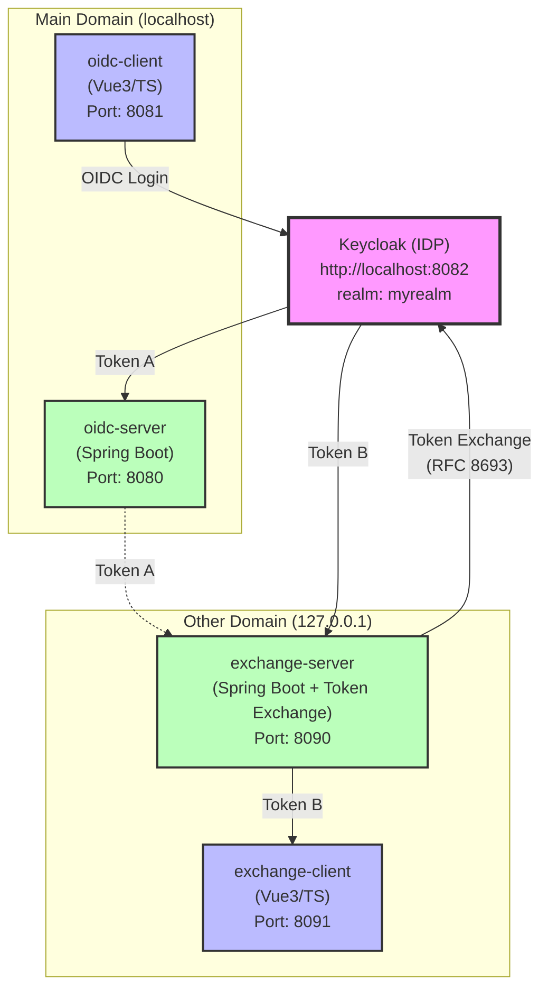

# OIDC Token Exchange Sample

Keycloak + Spring Boot + Vue.jsによる、**OIDC認証**と**Cross-Domain Token Exchange**の実装サンプルです。

## このプロジェクトについて

Main Domain（localhost）とOther Domain（127.0.0.1）という2つの異なるドメイン間で、Token Exchangeを使ったセキュアなクロスドメイン連携を実現します。

### 主な機能

- OIDC認証フロー（Authorization Code Flow with PKCE）
- Token Exchange（RFC 8693）によるクロスドメインSSO
- JWT検証とリソース保護
- Keycloak 26.5.2対応

## アーキテクチャ



## クイックスタート

### 1. Keycloakを起動

```bash
# Windows
cd oidc-idp\keycloak-26.5.2\bin
set KC_HTTP_PORT=8082
kc.bat start-dev

# Linux/Mac
cd oidc-idp/keycloak-26.5.2/bin
KC_HTTP_PORT=8082 ./kc.sh start-dev
```

起動完了まで1-2分待機 → http://localhost:8082

### 2. アプリケーションを起動

```bash
# Windows
scripts\start-all.bat

# Linux/Mac
./scripts/start-all.sh
```

### 3. アクセス

http://localhost:8081 → ログイン → 「Other Domainに移動」をクリック

## 詳細ドキュメント

すべての設定手順とトラブルシューティングは、**[QUICKSTART.md](QUICKSTART.md)** を参照してください。

- Keycloak初期設定
- クライアント作成手順
- Token Exchange設定
- トラブルシューティング

実装要件と詳細な技術情報は、**[oidc_implementation_guide.md](oidc_implementation_guide.md)** を参照してください。

## ポート構成

| サービス | ポート | 説明 |
|---------|--------|------|
| oidc-client | 8081 | Main Domain - フロントエンド |
| oidc-server | 8080 | Main Domain - バックエンドAPI |
| exchange-server | 8090 | Other Domain - Token Exchange API |
| exchange-client | 8091 | Other Domain - フロントエンド |
| Keycloak | 8082 | Identity Provider |

## プロジェクト構成

```
oidc-sample/
├── main/
│   ├── oidc-client/          # Vue3 + TypeScript (Main)
│   └── oidc-server/          # Spring Boot Resource Server
├── other/
│   ├── exchange-client/      # Vue3 + TypeScript (Other)
│   └── exchange-server/      # Spring Boot + Token Exchange
├── oidc-idp/
│   └── keycloak-26.5.2/      # Keycloak (ローカル版)
├── scripts/                  # 起動・停止スクリプト
└── logs/                     # アプリケーションログ
```

## 技術スタック

### Frontend
- Vue 3 + TypeScript
- Vite
- OIDC Client JS

### Backend
- Spring Boot 3.4.2
- Spring Security 6
- OAuth2 Resource Server
- Gradle

### Identity Provider
- Keycloak 26.5.2

## 参考資料

### ドキュメント

- [Keycloak Token Exchange](https://www.keycloak.org/securing-apps/token-exchange)
- [RFC 8693 - OAuth 2.0 Token Exchange](https://datatracker.ietf.org/doc/html/rfc8693)
- [PKCE - RFC 7636](https://datatracker.ietf.org/doc/html/rfc7636)

### シーケンス図

- [OIDC認証フロー（PlantUML版）](oidc_authorization_code_flow.puml) - 詳細なシーケンス図（PlantUML形式）
  - Mermaid版は [QUICKSTART.md](QUICKSTART.md) のセクション4-3を参照

## 注意事項

このサンプルは**学習・開発目的**です。本番環境では以下を考慮してください：

- トークンの安全な保管（HTTPSの使用）
- CORS設定の厳密化
- セッション管理の強化
- 適切なエラーハンドリング
- ログ・監査の実装

## ライセンス

このプロジェクトはMITライセンスの下で公開されています。
