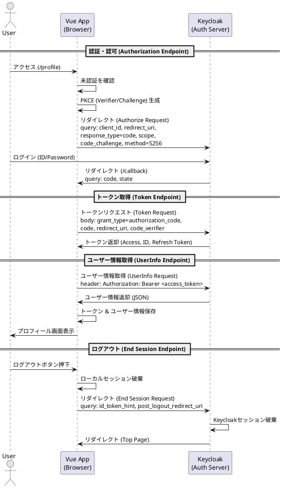

# Vue.js OIDC サンプルアプリケーション

`oidc-client-ts` を使用して、Authorization Code Flow + PKCE によるOpenID Connect (OIDC) 認証 を実装したVue.jsのサンプルアプリケーションです。

## 前提条件

- **Node.js**: v18以上（推奨）
- **Keycloak**: Keycloak（またはその他のOIDCプロバイダ）が稼働していること

## プロジェクトのセットアップ

1.  **依存関係のインストール**

    ```bash
    npm install
    ```

2.  **設定**

    `src/services/oidcService.ts` を開き、Keycloakの設定に合わせて `settings` オブジェクトを更新してください。

    ```typescript
    const settings: UserManagerSettings = {
      authority: 'http://localhost:8082/realms/myrealm', // レルムのURLに変更
      client_id: 'vue-client',                            // クライアントIDに変更
      redirect_uri: 'http://localhost:8081/callback',     // ポートが異なる場合は変更
      response_type: 'code',
      scope: 'openid profile email',
    };
    ```

    **Keycloak クライアント設定:**
    - **Client ID**: `vue-client`
    - **Client Protocol**: `openid-connect`
    - **Access Type**: `public`
    - **Standard Flow Enabled**: `ON` （認可コードフローを有効化）
    - **Valid Redirect URIs**: `http://localhost:8081/*` (Viteの設定ポートは8081です)
    - **Web Origins**: `http://localhost:8081` (CORS設定)
    - **PKCE Challenge Method**: `S256`

## アプリケーションの実行

1.  **開発サーバーの起動**

    ```bash
    npm run dev
    ```

2.  **アプリへのアクセス**

    ブラウザで `http://localhost:8081` にアクセスしてください。

## 機能（画面構成）

- **Login (`/login`)**:
  - `Login.vue`
  - 「Login with Keycloak」ボタンを表示します。
  - ボタン押下で `oidcService.login()` を呼び出し、Keycloakの認証画面へリダイレクトします。

- **Callback (`/callback`)**:
  - `Callback.vue`
  - Keycloakからのリダイレクト（認可コード付き）を受け取ります。
  - `oidcService.handleCallback()` でトークン交換と検証を自動実行します。
  - 成功後、`/profile` へ遷移します。

- **Profile (`/profile`)**:
  - `Profile.vue`
  - ログインユーザーの情報を表示します（IDトークンから取得）。
  - 未認証状態でアクセスすると `/login` へリダイレクトされます（Router Navigation Guard）。
  - 「Logout」ボタンでセッションを終了します。

## プロジェクト構造

```
oidc-client/
├── src/
│   ├── assets/          # 静的アセット
│   ├── components/      # 共通コンポーネント
│   ├── router/
│   │   └── index.ts     # ルーティング設定（ガード処理含む）
│   ├── services/
│   │   └── oidcService.ts # OIDCクライアント設定とロジック
│   ├── views/
│   │   ├── Login.vue    # ログイン画面
│   │   ├── Callback.vue # コールバック処理画面
│   │   └── Profile.vue  # プロフィール画面
│   ├── App.vue          # ルートコンポーネント
│   └── main.ts          # エントリポイント
├── package.json
└── vite.config.ts
```

## OIDC認証フロー (Authorization Code Flow with PKCE)



## リクエスト・レスポンスの例

### 1. 認証・認可 (Authorization Endpoint)

#### Request (Browser -> Keycloak)

```http
GET /realms/myrealm/protocol/openid-connect/auth?
    client_id=vue-client
    &redirect_uri=http%3A%2F%2Flocalhost%3A8081%2Fcallback
    &response_type=code
    &scope=openid%20profile%20email
    &state=...
    &code_challenge=...
    &code_challenge_method=S256 HTTP/1.1
Host: localhost:8082
```

#### Response (Keycloak -> Browser)

認証成功後、`redirect_uri` への302リダイレクトが発生します。

```http
HTTP/1.1 302 Found
Location: http://localhost:8081/callback?code=...&state=...
```

### 2. トークン取得 (Token Endpoint)

#### Request (Vue App -> Keycloak)

```http
POST /realms/myrealm/protocol/openid-connect/token HTTP/1.1
Host: localhost:8082
Content-Type: application/x-www-form-urlencoded

grant_type=authorization_code
&client_id=vue-client
&code=...
&redirect_uri=http%3A%2F%2Flocalhost%3A8081%2Fcallback
&code_verifier=...
```

#### Response (Keycloak -> Vue App)

```json
{
  "access_token": "eyJhbGciOiJSUzI1Ni...",
  "expires_in": 300,
  "refresh_expires_in": 1800,
  "refresh_token": "eyJhbGciOiJSUzI1Ni...",
  "token_type": "Bearer",
  "id_token": "eyJhbGciOiJSUzI1Ni...",
  "not-before-policy": 0,
  "session_state": "..."
}
```

### 3. ユーザー情報取得 (UserInfo Endpoint)

#### Request (Vue App -> Keycloak)

```http
GET /realms/myrealm/protocol/openid-connect/userinfo HTTP/1.1
Host: localhost:8082
Authorization: Bearer <access_token>
```

#### Response (Keycloak -> Vue App)

```json
{
  "sub": "f5f5f5f5-...",
  "email_verified": true,
  "name": "Test User",
  "preferred_username": "testuser",
  "given_name": "Test",
  "family_name": "User",
  "email": "test@example.com"
}
```

### 4. ログアウト (End Session Endpoint)

#### Request (Browser -> Keycloak)

```http
GET /realms/myrealm/protocol/openid-connect/logout?
    id_token_hint=...
    &post_logout_redirect_uri=http%3A%2F%2Flocalhost%3A8081%2F
```

#### Response (Keycloak -> Browser)

セッション破棄後、`post_logout_redirect_uri` へのリダイレクトが発生します。

```http
HTTP/1.1 302 Found
Location: http://localhost:8081/
```
