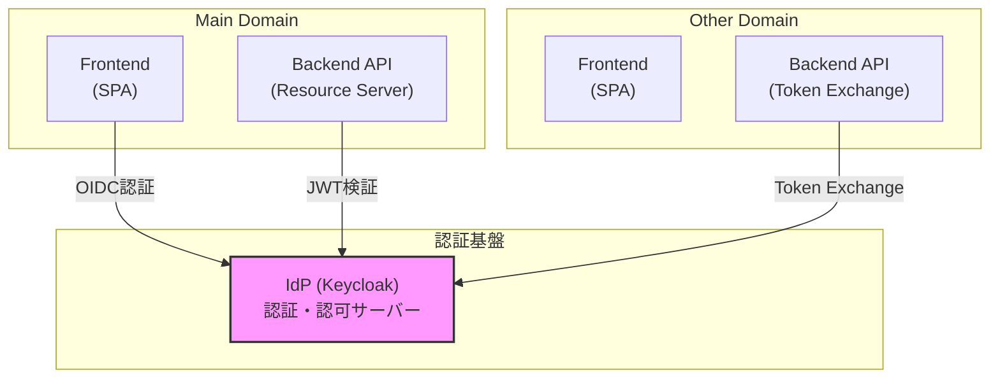
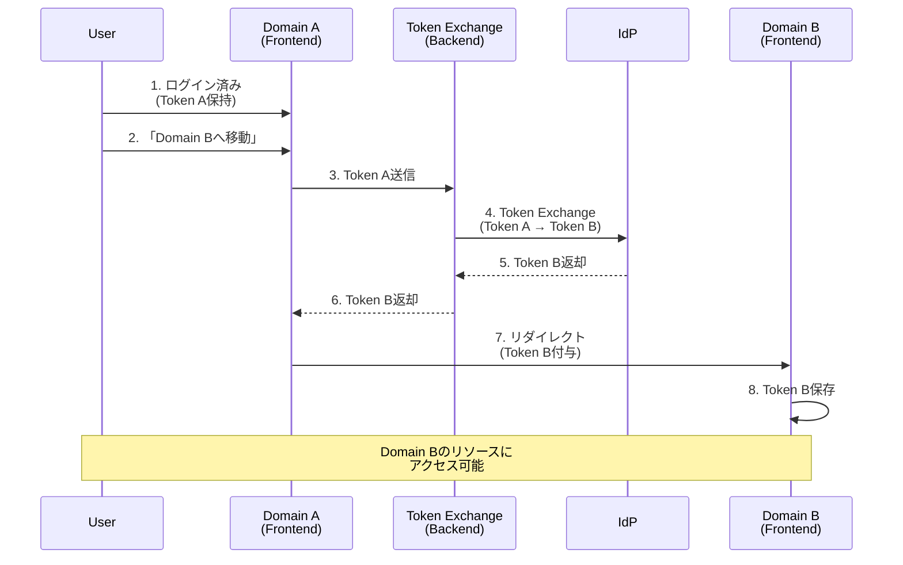

# OIDC実装要件ガイド

このドキュメントは、OIDC（OpenID Connect）認証とToken Exchangeによるクロスドメイン連携を実装する際の**要件**と**設計方針**を定義します。

> **具体的な手順**: [QUICKSTART.md](QUICKSTART.md) を参照  
> **プロジェクト概要**: [README.md](README.md) を参照

## 目次

1. [実装の目的と範囲](#1-実装の目的と範囲)
2. [アーキテクチャ設計方針](#2-アーキテクチャ設計方針)
3. [セキュリティ要件](#3-セキュリティ要件)
4. [各コンポーネントの責務](#4-各コンポーネントの責務)
5. [Token Exchangeの設計方針](#5-token-exchangeの設計方針)
6. [実装要件チェックリスト](#6-実装要件チェックリスト)
7. [セキュリティ考慮事項](#7-セキュリティ考慮事項)
8. [参考仕様](#8-参考仕様)

---

## 1. 実装の目的と範囲

### 目的

本プロジェクトは、以下の要件を満たすOIDC認証システムを実装します：

1. **標準準拠の認証フロー**: OAuth 2.0 / OpenID Connect 1.0 に準拠
2. **セキュアな実装**: PKCE、state、nonceによる多層防御
3. **クロスドメイン連携**: Token Exchangeによる異なるドメイン間のSSO実現
4. **モダンな技術スタック**: SPA（Vue.js）とマイクロサービス（Spring Boot）の構成

### 実装範囲

| 機能領域 | 実装内容 |
|---------|---------|
| **認証** | OIDC Authorization Code Flow with PKCE |
| **認可** | JWTによるAPIアクセス制御 |
| **SSO** | Token Exchange（RFC 8693）によるクロスドメイン連携 |
| **IdP** | Keycloak（Self-hosted） |

### 対象外

以下は本プロジェクトの範囲外とします：

- ソーシャルログイン（Google, GitHubなど）
- 多要素認証（MFA）
- ユーザー登録・パスワードリセット機能
- 本番環境向けの運用設計（監視、バックアップなど）

---

## 2. アーキテクチャ設計方針

### システム構成

本システムは、以下の3つのドメインで構成されます：

### 設計原則

#### 原則1: ゼロトラストセキュリティ

すべてのAPIリクエストは、有効なJWTトークンがなければアクセス不可。

#### 原則2: Statelessアーキテクチャ

- サーバー側でセッション状態を保持しない
- JWTに必要な情報を含める
- スケーラビリティを確保

#### 原則3: 関心の分離

| レイヤー | 責務 |
|---------|------|
| **Frontend** | 認証フローの制御、UIの提供 |
| **Backend API** | ビジネスロジック、リソース保護 |
| **IdP** | 認証・認可、トークン発行 |

#### 原則4: 標準仕様への準拠

- OIDC Core 1.0
- OAuth 2.0 (RFC 6749)
- PKCE (RFC 7636)
- Token Exchange (RFC 8693)

---

## 3. セキュリティ要件

### 必須セキュリティパラメータ

OIDC認証では、以下のパラメータを**必ず実装**すること：

#### PKCE (Proof Key for Code Exchange)

**目的**: 認可コードインターセプト攻撃の防止

**仕組み**:
1. クライアントが `code_verifier`（ランダム文字列）を生成
2. `SHA256(code_verifier)` → `code_challenge` を計算
3. 認可リクエスト時に `code_challenge` を送信
4. トークン交換時に `code_verifier` を送信
5. IdPが `SHA256(code_verifier)` == `code_challenge` を検証

**要件**:
- Challenge Method: `S256`（SHA256）を使用
- Plain textは使用不可（セキュリティ上脆弱）

**防止する攻撃**: Authorization Code Interception Attack

#### state

**目的**: CSRF（Cross-Site Request Forgery）攻撃の防止

**仕組み**:
1. クライアントがランダムな `state` を生成
2. 認可リクエスト時に `state` を送信
3. コールバック時に返却された `state` を検証

**要件**:
- 十分なエントロピー（ランダム性）を持つ値
- セッションごとに一意な値

**防止する攻撃**: Login CSRF、強制ログイン攻撃

#### nonce

**目的**: リプレイ攻撃の防止

**仕組み**:
1. クライアントがランダムな `nonce` を生成
2. 認可リクエスト時に `nonce` を送信
3. IDトークン内の `nonce` クレームを検証

**要件**:
- IDトークン受信時に必ず検証
- 使用済みnonceの再利用を防止

**防止する攻撃**: Token Replay Attack

### セキュリティパラメータの責務分担

| パラメータ | 生成者 | 検証者 | タイミング |
|-----------|--------|--------|-----------|
| **code_challenge** | Frontend | IdP | 認可リクエスト時 |
| **code_verifier** | Frontend | IdP | トークン交換時 |
| **state** | Frontend | Frontend | コールバック時 |
| **nonce** | Frontend | Frontend | IDトークン受信時 |

### JWT検証要件

Resource Serverは、受信したJWTに対して以下を検証すること：

1. **署名検証**: IdPの公開鍵で署名を検証
2. **有効期限**: `exp` クレームが現在時刻より未来
3. **発行時刻**: `iat` クレームが妥当な範囲
4. **発行者**: `iss` クレームがIdPのURLと一致
5. **オーディエンス**: `aud` クレームが自身のClient IDを含む

---

## 4. 各コンポーネントの責務

### IdP（Identity Provider）の責務

| 責務 | 詳細 |
|------|------|
| **ユーザー認証** | ユーザー名・パスワードの検証 |
| **認可判断** | スコープ・ロールに基づくアクセス制御 |
| **トークン発行** | Access Token、ID Token、Refresh Tokenの発行 |
| **PKCE検証** | code_challenge と code_verifier の一致確認 |
| **Token Exchange** | ドメイン間のトークン変換 |

**実装要件**:
- OIDC Discovery endpoint の提供
- JWKS（JSON Web Key Set）endpoint の提供
- Token Exchange endpoint の提供

### Frontend（SPA）の責務

| 責務 | 詳細 |
|------|------|
| **認証フロー制御** | OIDC認証の開始、コールバック処理 |
| **セキュリティパラメータ生成** | state、nonce、PKCE の生成・検証 |
| **トークン管理** | Access Tokenの保存・取得・削除 |
| **API呼び出し** | Authorization ヘッダーへのトークン付与 |

**実装要件**:
- OIDCライブラリの使用（手動実装は避ける）
- トークンの安全な保存（localStorage/sessionStorage）
- トークン有効期限の監視とリフレッシュ

### Backend API（Resource Server）の責務

| 責務 | 詳細 |
|------|------|
| **JWT検証** | トークンの署名・有効期限・発行者の検証 |
| **リソース保護** | 認証済みリクエストのみ処理 |
| **スコープチェック** | APIごとに必要なスコープを確認 |
| **ビジネスロジック** | 認可後のビジネスロジック実行 |

**実装要件**:
- OAuth2 Resource Server機能の有効化
- JWT検証の自動化（フレームワーク機能を活用）
- Public endpointと Protected endpointの明確な分離

### Token Exchange Server の責務

| 責務 | 詳細 |
|------|------|
| **トークン変換** | Main DomainのトークンをOther Domain用に変換 |
| **JWT検証** | 受信したトークンの正当性確認 |
| **IdP連携** | Token Exchange endpointの呼び出し |

**実装要件**:
- RFC 8693準拠のToken Exchange実装
- Service Account権限の設定
- エラーハンドリングの実装

---

## 5. Token Exchangeの設計方針

### Token Exchangeの目的

異なるドメイン間で、**再認証なし**にリソースアクセスを可能にする。

### フロー設計

### RFC 8693 準拠要件

Token Exchangeは、以下のパラメータで実装すること：

| パラメータ | 値 | 必須 |
|-----------|-----|------|
| `grant_type` | `urn:ietf:params:oauth:grant-type:token-exchange` | ✅ |
| `subject_token` | 交換元のトークン（Token A） | ✅ |
| `subject_token_type` | `urn:ietf:params:oauth:token-type:access_token` | ✅ |
| `audience` | ターゲットクライアント（実装依存） | ❌* |

*Keycloak 26.5.2では、Standard Token Exchangeを使用する場合、audienceパラメータは不要。

### 権限設計

Token Exchangeを実行するクライアントには、以下の権限が必要：

- **Service Account有効化**: IdPに対して直接トークンリクエストを実行
- **manage-clientsロール**: realm-management の権限

### セキュリティ制約

- Token Exchangeは**Backend to Backend**で実行（Frontendから直接呼ばない）
- 交換元トークンの検証を必ず実施
- 交換後トークンの有効期限を適切に設定

---

## 6. 実装要件チェックリスト

### IdP設定

- [ ] Realmの作成
- [ ] Main Domain用クライアントの作成
  - [ ] Client authentication: ON（Confidential Client）
  - [ ] Standard Flow: ON
  - [ ] PKCE Challenge Method: S256
  - [ ] Service Account有効化
  - [ ] manage-clientsロール付与
- [ ] Other Domain用クライアントの作成
  - [ ] Client authentication: ON
  - [ ] Direct Access Grants: ON
  - [ ] Service Account有効化
  - [ ] manage-clientsロール付与
- [ ] テストユーザーの作成

### Frontend実装

- [ ] OIDCライブラリの導入（oidc-client-ts等）
- [ ] 認証設定の定義
  - [ ] Authority（IdP URL）
  - [ ] Client ID
  - [ ] Redirect URI
  - [ ] Response Type: `code`
  - [ ] Scope: `openid profile email`
- [ ] ログイン機能の実装
- [ ] コールバック処理の実装（state,nonce自動検証）
- [ ] ログアウト機能の実装
- [ ] トークンストレージの実装
- [ ] API呼び出し時のAuthorization ヘッダー付与

### Backend API実装

- [ ] OAuth2 Resource Server依存関係の追加
- [ ] JWT検証設定
  - [ ] Issuer URI設定
  - [ ] 公開鍵自動取得の有効化
- [ ] Security設定
  - [ ] Public endpointの定義
  - [ ] Protected endpointの定義
- [ ] CORS設定（Frontend URLの許可）

### Token Exchange実装

- [ ] Token Exchange用クライアント設定（IdP側）
- [ ] Token Exchange API実装（Backend）
  - [ ] RFC 8693パラメータの送信
  - [ ] Client認証の実装
  - [ ] エラーハンドリング
- [ ] Frontend統合
  - [ ] Token Exchange APIの呼び出し
  - [ ] 取得したトークンの保存
  - [ ] ドメイン間リダイレクト

---

## 7. セキュリティ考慮事項

### トークン保存

| 保存場所 | 特徴 | 推奨 |
|---------|------|------|
| **localStorage** | 永続化、XSS脆弱 | ⚠️ XSS対策必須 |
| **sessionStorage** | タブ閉じると消える | ✅ 推奨 |
| **Cookie (HttpOnly)** | XSS耐性高い、CSRF注意 | ✅ 推奨（Backend管理） |
| **メモリ** | 最も安全、リロードで消える | ⚠️ UX低下 |

### HTTPS必須

本番環境では**必ずHTTPS**を使用すること。HTTP環境では：

- トークンが平文で送信される
- MITM（中間者攻撃）のリスク
- PKCE、stateも無意味化

### CORS設定

- 必要最小限のOriginのみ許可
- ワイルドカード（`*`）は使用不可
- Credentialsを含む場合は明示的なOrigin指定

### トークン有効期限

| トークン種別 | 推奨有効期限 | 備考 |
|-------------|-------------|------|
| **Access Token** | 5-15分 | 短い方が安全 |
| **ID Token** | 5-15分 | Access Tokenと同じ |
| **Refresh Token** | 1-7日 | Rotation推奨 |

### ログ・監査

以下のイベントをログ出力すること：

- 認証成功/失敗
- Token Exchange実行
- JWT検証失敗
- 権限不足によるアクセス拒否

---

## 8. 参考仕様

### OIDC / OAuth 2.0

- [OpenID Connect Core 1.0](https://openid.net/specs/openid-connect-core-1_0.html)
- [OAuth 2.0 - RFC 6749](https://datatracker.ietf.org/doc/html/rfc6749)
- [PKCE - RFC 7636](https://datatracker.ietf.org/doc/html/rfc7636)
- [OAuth 2.0 Token Exchange - RFC 8693](https://datatracker.ietf.org/doc/html/rfc8693)

### Keycloak

- [Keycloak Documentation](https://www.keycloak.org/documentation)
- [Keycloak Token Exchange](https://www.keycloak.org/securing-apps/token-exchange)

### セキュリティガイド

- [OAuth 2.0 Security Best Current Practice](https://datatracker.ietf.org/doc/html/draft-ietf-oauth-security-topics)
- [OAuth 2.0 for Browser-Based Apps](https://datatracker.ietf.org/doc/html/draft-ietf-oauth-browser-based-apps)
