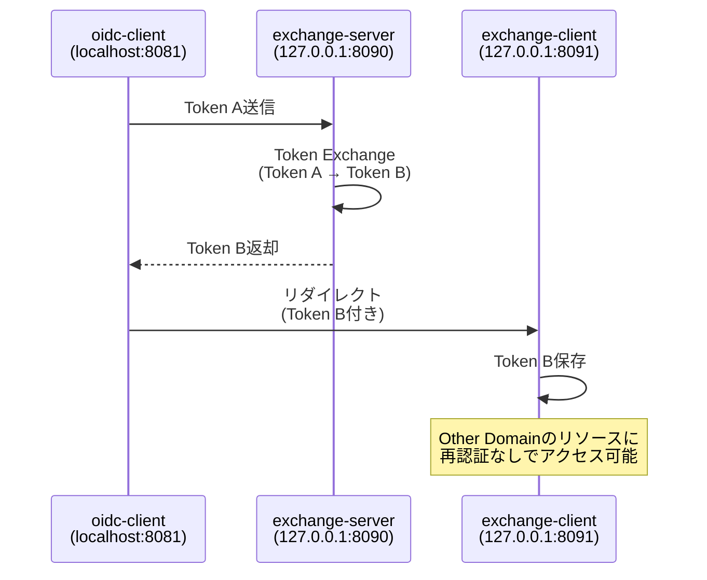

# Exchange Client

Other DomainのフロントエンドSPAです。Token Exchangeを使用してクロスドメインSSOを実現します。

## このコンポーネントについて

Other Domain（127.0.0.1:8091）で動作するVue.jsアプリケーションです。Main Domainで取得したトークンをToken Exchangeで変換し、再認証なしでOther Domainにアクセスできます。

### 主な機能

- Token Exchange APIの呼び出し
- Main Domain（localhost）で取得したトークンをOther Domain（127.0.0.1）用に変換
- 変換後トークンの管理
- Protected APIの呼び出し
- クロスドメインSSO実証

### 技術スタック

- Vue 3（Composition API）
- TypeScript
- Vue Router
- oidc-client-ts（OIDC認証ライブラリ）
- Vite（ビルドツール）

## クイックスタート

```bash
# 依存関係インストール
npm install

# 開発サーバー起動
npm run dev
```

アプリケーションは http://127.0.0.1:8091 で起動します。

> **詳細な設定手順**: [QUICKSTART.md](../../QUICKSTART.md) を参照

## ディレクトリ構成

```
exchange-client/
├── src/
│   ├── services/          # Token Exchange・API呼び出しロジック
│   │   ├── oidcService.ts
│   │   └── apiService.ts
│   ├── views/             # ページコンポーネント
│   │   ├── Home.vue
│   │   ├── Callback.vue
│   │   └── Dashboard.vue
│   ├── router/            # ルーティング設定
│   │   └── index.ts
│   ├── App.vue
│   └── main.ts
├── public/
├── index.html
├── package.json
├── vite.config.ts
└── tsconfig.json
```

## Token Exchange フロー



### ポイント

- **localhost と 127.0.0.1 は異なるドメイン**として扱われる
- Token Exchangeにより、ドメインをまたいだSSOが実現
- ユーザーは再ログイン不要

## 提供するページ

| ページ | パス | 説明 |
|-------|------|------|
| Home | `/` | ログイン前のトップページ |
| Callback | `/callback` | Token Exchange後のコールバック処理 |
| Dashboard | `/dashboard` | Token B使用後のダッシュボード（Protected） |

## 関連ドキュメント

- [プロジェクト全体の概要](../../README.md)
- [セットアップガイド](../../QUICKSTART.md)
- [実装要件](../../oidc_implementation_guide.md)
- [RFC 8693 - OAuth 2.0 Token Exchange](https://datatracker.ietf.org/doc/html/rfc8693)
