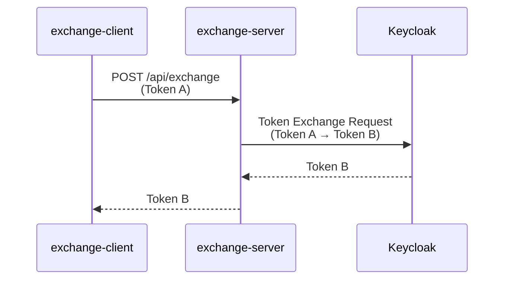

# Exchange Server

Other DomainのバックエンドAPIサーバーです。Token Exchange（RFC 8693）機能を提供し、クロスドメインSSOを実現します。

## このコンポーネントについて

Other Domain（127.0.0.1:8090）で動作するSpring Bootアプリケーションです。Main DomainのトークンをOther Domain用トークンに交換し、ドメインを超えたシームレスなSSOを実現します。

### 主な機能

- Token Exchange API（RFC 8693準拠）
- KeycloakのToken Exchange endpointとの連携
- Main Domain → Other Domain のトークン変換
- JWT検証（受信トークン、交換後トークン）
- Protected APIの提供

### 技術スタック

- Spring Boot 3.4.2
- Spring Security OAuth2 Resource Server
- Spring Security OAuth2 Client
- Spring WebFlux（WebClient）
- Java 21
- Gradle

## クイックスタート

```bash
# ビルド
./gradlew build

# 起動
./gradlew bootRun
```

> Windows: `gradlew.bat bootRun`

アプリケーションは http://127.0.0.1:8090 で起動します。

> **詳細な設定手順**: [QUICKSTART.md](../../QUICKSTART.md) を参照

## ディレクトリ構成

```
exchange-server/
├── src/
│   ├── main/
│   │   ├── java/com/example/exchangeserver/
│   │   │   ├── ExchangeServerApplication.java
│   │   │   ├── config/
│   │   │   │   └── SecurityConfig.java
│   │   │   ├── controller/
│   │   │   │   └── TokenExchangeController.java
│   │   │   └── service/
│   │   │       └── TokenExchangeService.java
│   │   └── resources/
│   │       └── application.yml
│   └── test/
├── build.gradle
└── settings.gradle
```

## 提供するAPI

| エンドポイント | メソッド | 認証 | 説明 |
|--------------|---------|------|------|
| `/api/public` | GET | 不要 | 動作確認用 Public API |
| `/api/exchange` | POST | 必要 | Token Exchange実行 |
| `/api/protected/info` | GET | 必要 | サーバー情報取得 |

### Token Exchange フロー



**パラメータ**:
- `grant_type`: `urn:ietf:params:oauth:grant-type:token-exchange`
- `subject_token`: Main DomainのToken A
- `subject_token_type`: `urn:ietf:params:oauth:token-type:access_token`

## 関連ドキュメント

- [プロジェクト全体の概要](../../README.md)
- [セットアップガイド](../../QUICKSTART.md)
- [実装要件](../../oidc_implementation_guide.md)
- [RFC 8693 - OAuth 2.0 Token Exchange](https://datatracker.ietf.org/doc/html/rfc8693)

### CORS エラーが発生する場合

`application.yml` の `cors.allowed-origins` を確認：
```yaml
cors:
  allowed-origins: http://127.0.0.1:8091
```
